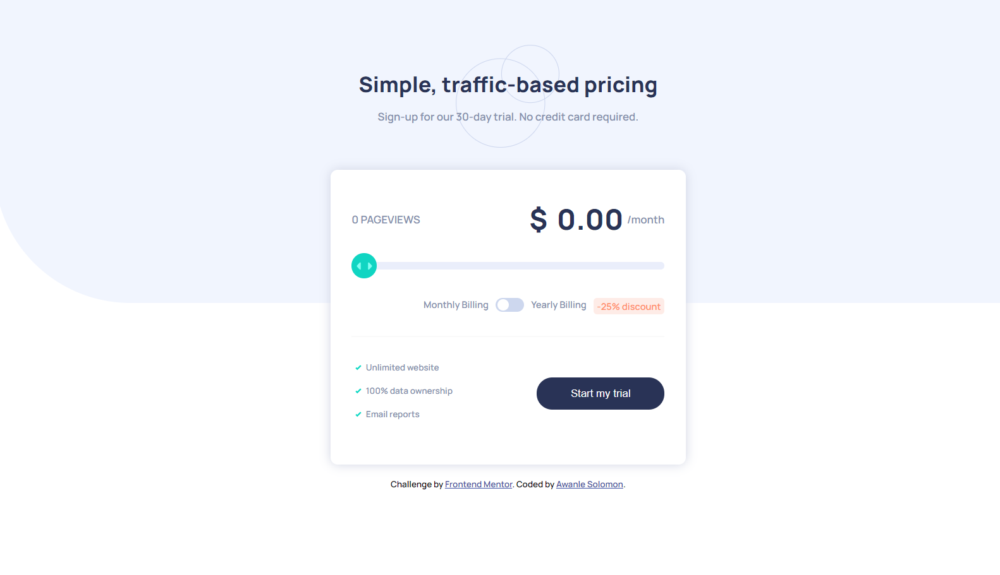

# Frontend Mentor - Interactive pricing component solution

This is a solution to the [Interactive pricing component challenge on Frontend Mentor](https://www.frontendmentor.io/challenges/interactive-pricing-component-t0m8PIyY8). Frontend Mentor challenges help you improve your coding skills by building realistic projects.

## Table of contents

- [Overview](#overview)
  - [The challenge](#the-challenge)
  - [Screenshot](#screenshot)
  - [Links](#links)
- [My process](#my-process)
  - [Built with](#built-with)
- [Author](#author)

## Overview

### The challenge

Users should be able to:

- See hover states for interactive elements
- Toggle between Monthly and Yearly billing
- Select from 5 different pricing options

### Screenshot

### Links

- Solution URL: [https://github.com/ASO-CODE/Frontend-Mentor-Interactive-pricing-component](https://github.com/ASO-CODE/Frontend-Mentor-Interactive-pricing-component)
- Live Site URL: [https://asocode-interactive-pricing-component.netlify.app/](https://asocode-interactive-pricing-component.netlify.app/)

## My process

### Built with

- Semantic HTML5 markup
- CSS custom properties
- Flexbox
- Mobile-first workflow
- JavaScript

## Author

- Frontend Mentor - [@ASO-CODE](https://www.frontendmentor.io/profile/ASO-CODE)
- Twitter - [@SAwanle](https://www.twitter.com/SAwanle)
